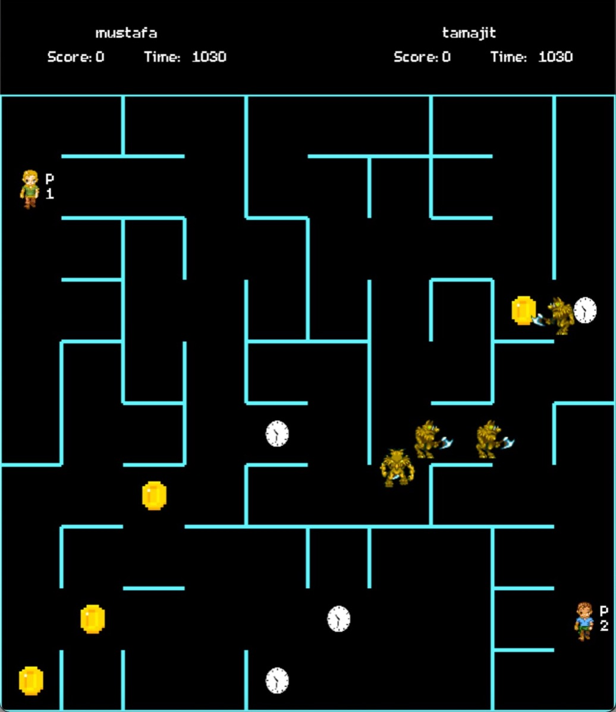
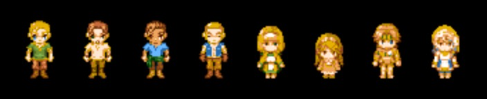
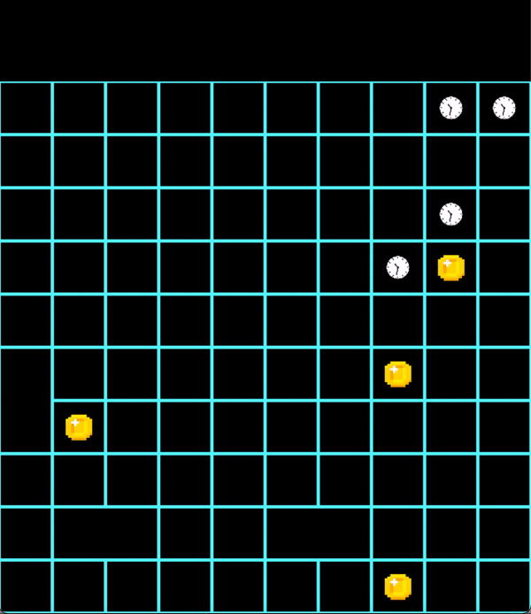
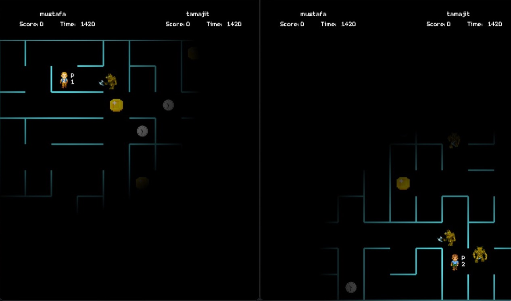

# The Game of Time

A maze-based two-player game written in C++, using SDL and socket programming!

## Basic Outline of Game

As a player roams around in a randomly generated maze, he/she tries to collect coins to increase his/her score. As with life, their time in the game is limited, and a constant stop-watch tells them how long they have left. The players also have the option of eating a 'clock' (time booster) that grants them extra time (thus extending their life). After a time booster is eaten, a new time booster is generated with a probability of 0.9. The time boosters on the maze should eventually reduce to zero (we have not cracked immortality, yet).

The players cannot move freely in the maze though. Randomly located in the maze are four monsters! Two of the monsters chase the players (one each), and can randomly stop chasing them and again randomly start chasing them. The players constantly need to take care that they are not eaten by a monster. We believe in second chances, and all players are given quite a few chances. On being hit by a monster, the player does not simply die, and loses some time being frozen(shortening their life).

The amount of randomness involved in the game is sufficient to keep the player guessing for a sure shot winning strategy. To make it even harder to guess the outcome of a game, random walls from the maze are removed at regular intervals, so that the players can have more options to escape from the monsters, and also more paths to reach to the coin or time they have in sight.

As the game progresses, multiple levels are introduced with harder obstacles. With subsequent levels, the monsters become more aggressive, chasing their dream player more often than before. At the third level, we introduce partial visibility (modelling realistic light-outs). As the players go to the final level, the visibility reduces further, with only just a few neighbouring cells visible.

The primary directive in the game is to increase score. The player with the higher score wins! Aside from increasing one's own score, a player can also chose to reduce their fellow player's score by shooting bullets to each other. The bullets again freeze players and waste their precious, score-giving time. To promote fairness, we introduce a cost to each bullet, and shooting your fellow players will reduce your score.

Finally, a level ends when both players' time runs out. 

   
  Screen of the game

### Some rules

1) Players can collect coins and time boosters. Players can move with the arrow keys (up, down, right left)
2) Players can shoot bullets to other players with w, a, s, and d keys
3) The maze gets generated randomly in each level and in each run of the game. 
4) Two monsters chase after players (one for each player) and two more monsters move about randomly.

## Algorithmic Details

### The player

The player on-screen responds to the human player's key press movements and changes its location accordingly. While the game is going on, the server keeps sending its player's information (position, id, bullets etc) and receives the info of the client player. This is how the two games are being synchronised. Appropriate error messages are displayed when a receive was expected but absent or when a send failed. Again, information about whether the player has quit or is still playing is also exchanged here. 
    
### The monster

The monsters demonstrate intelligennt movements in addition to their random nature. At the center of every maze cell, a monster will either decide to chase a player or go to some other cell location in a different quadrant (quarter portion of the maze). The monster keeps doing this movement for some random amount of time and after it has travelled for some number of cells, it again decides to chase or move randomly. 

### The maze cell

We start with a maze where each cell has all of its walls intact. Gradually, using Kruskal's algorithm, we chose walls and remove them to eventually create our maze. The maze uses random number generators so that different mazes can be generated across levels. Also, its seed is set by the global time the game starts running. Now, this seed is assigned only in the server and this seed is sent to the client via our sockets. Thus, with the same seed, we obtain a random, yet deterministic (same for both players) game. 

## Installation Instructions

The game was built and tested on macOS Big Sur (ver 11.3 onwards). To install dependencies using [homebrew](https://brew.sh), run:

~~~
brew install sdl2
brew install sdl2_ttf
brew install sdl2_mixer
brew install sdl2_gfx
~~~
or simply run 
~~~
make setup
~~~

## Special Features

#### Mupltiple Avatars

The players are given an option to chose from 8 different avatars (gender-inclusive). 

   
  The different Avatars

#### Maze Generation Animations

Our maze is generated every time a level starts. We display this process of maze generation to the player.

      
  This is a gif of when the maze is being generated using the Kruskal's algorithm

#### Partial Visibility

We have added a feature where each player cannot see the entire maze, but only some neighbouring region around their current location. 

    
  Partial Visibility

#### TCP Sockets

We have implemented raw sockets using TCP to exchange the information between players. We have tried to minimise the amount of the information exchanged so that we can optimise the speed.

#### Pseudo Random Number Generator

We have used pseudo random number generator to randomise the creation of the maze and movements of the monsters to eliminate the cost of sending these informations across players.  

## Documentation

Detailed rules of the game, along with description of the different stages can be found [here](https://drive.google.com/drive/folders/1H2WBtCfxBOw4zcmwrzM9qh3TLa_TPsj1?usp=sharing) ([pdf](assets/Description_Overview.pdf)).

## Some Resources Used

1. 2D Birch Engine ([git](https://github.com/carlbirch/BirchEngine/tree/master/BirchEngine)) ([youtube](https://www.youtube.com/watch?v=yFLa3ln16w0))
2. SDL Game with sockets ([git](https://github.com/maciejspychala/sdl-game))
3. SDL_Wiki ([webpage](https://wiki.libsdl.org))
4. Maze Generator ([git](https://github.com/razimantv/mazegenerator))
